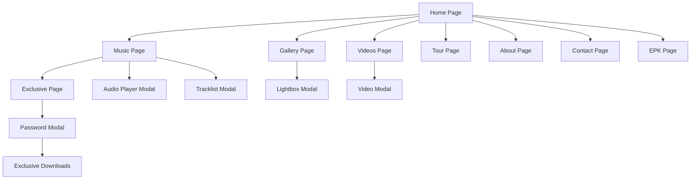

# DJ JOEL - Modern Dark-Mode DJ/Artist Website

## 1. Product Overview

DJ JOEL is a modern, dark-mode artist website featuring a moody, nocturnal aesthetic with cyberpunk-inspired glitch effects and red accent colors. The platform serves as a comprehensive digital presence for the DJ/artist, providing music streaming, exclusive content access, tour information, and fan engagement tools.

The website targets electronic music fans and industry professionals, offering an immersive audio-visual experience that reflects the artist's brand identity. The platform aims to increase fan engagement, streamline music distribution, and provide professional resources for booking and press inquiries.

## 2. Core Features

### 2.1 User Roles

| Role | Registration Method | Core Permissions |
|------|---------------------|------------------|
| Visitor | No registration required | Browse public content, stream singles, view gallery |
| Authenticated User | Password access for exclusive content | Access password-protected tracks, download exclusive content |
| Industry Professional | Direct contact via forms | Access EPK materials, booking information |

### 2.2 Feature Module

Our DJ JOEL website consists of the following main pages:

1. **Home page**: hero section with glitch effects, featured tracks showcase, upcoming show highlights, featured video, newsletter signup
2. **Music page**: singles streaming cards, EPs/Albums grid with modal tracklists, sticky audio player with advanced controls
3. **Exclusive page**: password-protected section with secure download access, authentication modal
4. **Tour page**: upcoming shows with booking CTAs, past shows archive, venue information
5. **Gallery page**: masonry image layout with lightbox functionality, parallax hover effects
6. **Videos page**: embedded media with poster thumbnails, modal autoplay functionality
7. **About page**: artist biography, press quotes, achievements, brand collaborations, rider highlights
8. **Contact page**: management/booking contact information, contact form, social media links
9. **EPK page**: downloadable press kit materials, photos, logos, bios, technical rider

### 2.3 Page Details

| Page Name | Module Name | Feature description |
|-----------|-------------|---------------------|
| Home page | Hero Section | Animated glitch logo/text effects, background video loop or animated gradient, brand messaging |
| Home page | Featured Tracks | Showcase latest singles with play/download buttons, album artwork display |
| Home page | Show Highlights | Display upcoming tour dates with venue and ticket information |
| Home page | Newsletter | Email subscription form with validation and success states |
| Music page | Singles Section | Stream cards with play/download functionality, duration display, cover art |
| Music page | Albums/EPs Grid | Cover artwork grid, click opens tracklist modal with individual track controls |
| Music page | Audio Player | Sticky bottom player with playlist management, shuffle, loop, volume, progress bar |
| Exclusive page | Authentication | Password input modal with error/success states, device memory for access |
| Exclusive page | Secure Downloads | Protected download buttons revealed after authentication |
| Tour page | Upcoming Shows | Date, city, venue information with ticket purchase CTAs |
| Tour page | Past Shows Archive | Historical performance data with filtering capabilities |
| Gallery page | Image Grid | Masonry layout with lightbox functionality, parallax hover effects |
| Videos page | Media Embed | YouTube/Vimeo integration with poster thumbnails, modal autoplay |
| About page | Biography | Artist story, press quotes, achievements, brand collaborations |
| About page | Technical Rider | Performance requirements and specifications |
| Contact page | Contact Form | Name, email, message fields with validation and submission handling |
| Contact page | Social Links | Spotify, Apple Music, SoundCloud, YouTube, Instagram integration |
| EPK page | Download Center | Press photos, logo packs, bios, technical rider PDF downloads |
| Global | Navigation | Sticky top navigation with mobile hamburger menu |
| Global | Footer | Social icons, sitemap, copyright information |

## 3. Core Process

**Visitor Flow:**
Users land on the hero page with animated glitch effects and can immediately access featured tracks. They navigate through music sections to stream singles or explore albums via modal tracklists. Gallery and video sections provide visual content with lightbox/modal interactions. Contact and EPK sections serve professional inquiries.

**Exclusive Content Flow:**
Users attempting to access exclusive tracks encounter a password protection modal. Upon entering the correct password ("JOEL2025!"), access is granted and remembered on the device. Authenticated users can then download exclusive content securely.

**Audio Player Flow:**
Users can play tracks from any music section, which activates the sticky bottom audio player. The player maintains playlist state across page navigation, supports shuffle/loop modes, and provides full playback controls.

## 4. User Interface Design

### 4.1 Design Style

- **Primary Colors**: #ff2d55 (accent red), #0b0b0f (near-black background)
- **Secondary Colors**: #111116 (panels), #c6c6c6 (light text), #9b9b9b (muted text), #b1142a (hover/active red)
- **Typography**: Bebas Neue for headlines (condensed sans), Inter for body text (geometric sans)
- **Button Style**: Rounded corners with red accent background, subtle glow effects on hover
- **Layout Style**: Card-based design with subtle borders, backdrop blur effects, dark theme throughout
- **Visual Effects**: Neon glow, scanlines, grain/noise overlays, glitch text animations, thin red separators
- **Icons**: Lucide React icons with consistent sizing and red accent colors

### 4.2 Page Design Overview

| Page Name | Module Name | UI Elements |
|-----------|-------------|-------------|
| Home page | Hero Section | Full-width background with video/gradient, glitch text animation, CTA buttons with red glow |
| Home page | Featured Tracks | Card grid layout with album artwork, play/download buttons, hover scale effects |
| Music page | Audio Player | Sticky bottom bar with progress visualization, control buttons, album artwork thumbnail |
| Exclusive page | Password Modal | Centered modal with dark backdrop, input field with validation states, error messaging |
| Gallery page | Image Grid | Masonry layout with rounded corners, lightbox overlay with backdrop blur |
| Videos page | Video Grid | Thumbnail grid with play overlays, modal video player with controls |
| Tour page | Show Listings | Card layout with date/venue info, ticket CTAs with red accent styling |
| About page | Content Sections | Typography-focused layout with press quotes, achievement highlights |
| Contact page | Form Elements | Styled input fields with validation, social icon grid with hover effects |
| Global | Navigation | Sticky header with logo, menu items, mobile hamburger with slide-out panel |

### 4.3 Responsiveness

The website follows a mobile-first approach with responsive breakpoints at 640px (sm), 768px (md), 1024px (lg), and 1280px (xl). Touch interactions are optimized for mobile devices with appropriate button sizing and gesture support. The sticky audio player adapts to mobile with condensed controls, and navigation transforms to an off-canvas hamburger menu on smaller screens.