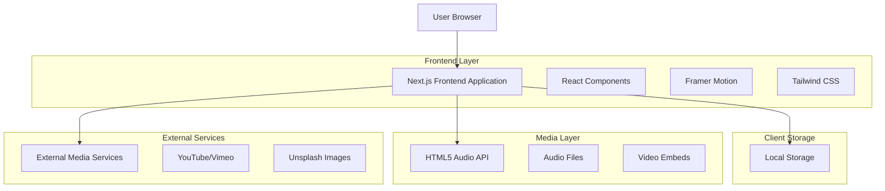
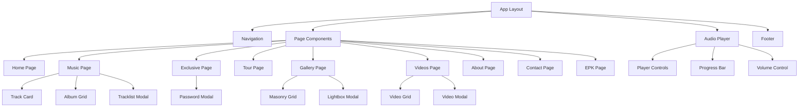
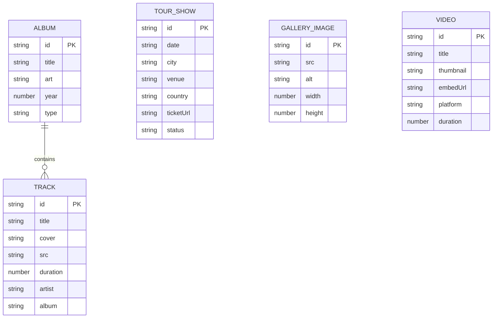

# DJ JOEL - Technical Architecture Document

## 1. Architecture Design



## 2. Technology Description

* Frontend: Next.js\@14 + React\@18 + TypeScript\@5 + Tailwind CSS\@3 + Framer Motion\@11

* Icons: Lucide React\@0.460

* Audio: HTML5 Audio API with custom controls

* Storage: localStorage for exclusive access tokens

* Deployment: Static export compatible

## 3. Route Definitions

| Route      | Purpose                                                      |
| ---------- | ------------------------------------------------------------ |
| /          | Home page with hero, featured content, and newsletter signup |
| /music     | Music streaming page with singles, albums, and audio player  |
| /exclusive | Password-protected exclusive tracks and downloads            |
| /tour      | Tour dates, upcoming shows, and past performance archive     |
| /gallery   | Image gallery with masonry layout and lightbox               |
| /videos    | Video content with embedded players and modal functionality  |
| /about     | Artist biography, press information, and achievements        |
| /contact   | Contact forms, management info, and social media links       |
| /epk       | Electronic press kit with downloadable assets                |

## 4. API Definitions

### 4.1 Core Data Types

**Track Interface**

```typescript
interface Track {
  id: string | number;
  title: string;
  cover: string;
  src: string;
  duration: number;
  artist?: string;
  album?: string;
}
```

**Album/EP Interface**

```typescript
interface Album {
  id: string;
  title: string;
  art: string;
  tracks: Track[];
  year: number;
  type: 'album' | 'ep' | 'single';
}
```

**Tour Show Interface**

```typescript
interface TourShow {
  id: string;
  date: string;
  city: string;
  venue: string;
  country: string;
  ticketUrl?: string;
  status: 'upcoming' | 'past' | 'cancelled';
}
```

**Gallery Image Interface**

```typescript
interface GalleryImage {
  id: string;
  src: string;
  alt: string;
  width: number;
  height: number;
}
```

**Video Interface**

```typescript
interface Video {
  id: string;
  title: string;
  thumbnail: string;
  embedUrl: string;
  platform: 'youtube' | 'vimeo';
  duration?: number;
}
```

### 4.2 Local Storage Schema

**Exclusive Access Token**

```typescript
interface ExclusiveAccess {
  hasAccess: boolean;
  timestamp: number;
  deviceId: string;
}
```

**Audio Player State**

```typescript
interface PlayerState {
  currentTrack: number;
  playlist: Track[];
  isPlaying: boolean;
  volume: number;
  shuffle: boolean;
  loop: 'none' | 'track' | 'playlist';
}
```

## 5. Component Architecture



## 6. Data Model

### 6.1 Data Structure Definition



### 6.2 Data Definition Language

**Static Data Files (TypeScript)**

```typescript
// lib/data/tracks.ts
export const singles: Track[] = [
  {
    id: 1,
    title: 'Neon Nights (Intro)',
    cover: 'https://images.unsplash.com/photo-1492684223066-81342ee5ff30',
    src: '/audio/neon-nights-intro.mp3',
    duration: 148,
    artist: 'DJ JOEL'
  },
  // Additional tracks...
];

// lib/data/albums.ts
export const albums: Album[] = [
  {
    id: 'midnight-sessions',
    title: 'Midnight Sessions',
    art: 'https://images.unsplash.com/photo-1520975922215-230f3c1f5d2e',
    year: 2024,
    type: 'ep',
    tracks: [
      // Track references...
    ]
  }
];

// lib/data/tours.ts
export const tourShows: TourShow[] = [
  {
    id: 'berlin-2024',
    date: '2024-12-15',
    city: 'Berlin',
    venue: 'Berghain',
    country: 'Germany',
    ticketUrl: 'https://example.com/tickets',
    status: 'upcoming'
  }
];

// lib/data/gallery.ts
export const galleryImages: GalleryImage[] = [
  {
    id: 'performance-1',
    src: 'https://images.unsplash.com/photo-1518895949257-7621c3c786d7',
    alt: 'DJ JOEL live performance',
    width: 1200,
    height: 800
  }
];

// lib/data/videos.ts
export const videos: Video[] = [
  {
    id: 'neon-nights-mv',
    title: 'Neon Nights - Official Music Video',
    thumbnail: 'https://images.unsplash.com/photo-1526481280698-8fcc13fd6ae0',
    embedUrl: 'https://www.youtube.com/embed/dQw4w9WgXcQ',
    platform: 'youtube',
    duration: 240
  }
];
```

**Utility Functions**

```typescript
// lib/utils/audio.ts
export const formatDuration = (seconds: number): string => {
  const minutes = Math.floor(seconds / 60);
  const remainingSeconds = Math.floor(seconds % 60);
  return `${minutes}:${remainingSeconds.toString().padStart(2, '0')}`;
};

// lib/utils/storage.ts
export const setExclusiveAccess = (hasAccess: boolean): void => {
  const accessData: ExclusiveAccess = {
    hasAccess,
    timestamp: Date.now(),
    deviceId: crypto.randomUUID()
  };
  localStorage.setItem('dj-joel-exclusive', JSON.stringify(accessData));
};

export const getExclusiveAccess = (): boolean => {
  try {
    const stored = localStorage.getItem('dj-joel-exclusive');
    if (!stored) return false;
    
    const accessData: ExclusiveAccess = JSON.parse(stored);
    const daysSinceAccess = (Date.now() - accessData.timestamp) / (1000 * 60 * 60 * 24);
    
    return accessData.hasAccess && daysSinceAccess < 30; // 30-day expiry
  } catch {
    return false;
  }
};
```

**Environment Configuration**

```typescript
// lib/config.ts
export const config = {
  exclusivePassword: process.env.NEXT_PUBLIC_EXCLUSIVE_PASSWORD || 'JOEL2025!',
  audioBaseUrl: process.env.NEXT_PUBLIC_AUDIO_BASE_URL || '/audio',
  contactEmail: process.env.NEXT_PUBLIC_CONTACT_EMAIL || 'booking@djjoel.com',
  socialLinks: {
    spotify: 'https://open.spotify.com/artist/djjoel',
    appleMusic: 'https://music.apple.com/artist/djjoel',
    soundcloud: 'https://soundcloud.com/djjoel',
    youtube: 'https://youtube.com/@djjoel',
```

